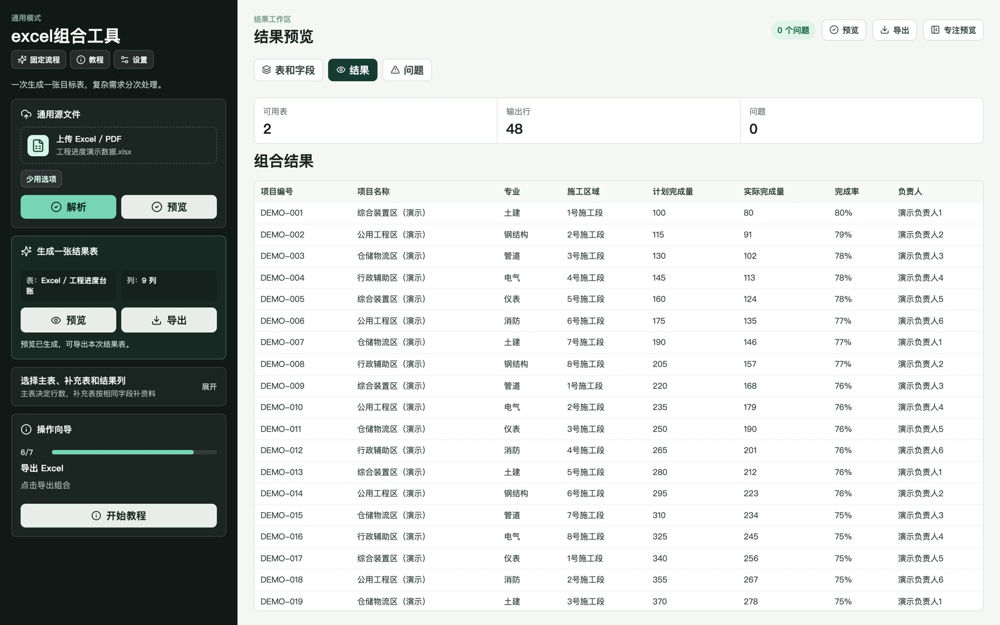

# Excel 表格工具

[](LICENSE) [](https://react.dev/) [](https://www.typescriptlang.org/)

在网页中完成 Excel/PDF 解析、字段匹配和多表组合。上传来源文件，选择主表、补充表与输出列，先预览匹配结果和问题，再导出新的 Excel 工作簿。

[界面预览](#界面预览) · [在线体验](#在线体验) · [快速开始](#快速开始) · [文档](#文档) · [作者作品集](http://43.156.229.191:8080/portfolio/)

> 这是带服务端的 Web 工具：文件上传至你所使用的服务处理，并非纯浏览器本地计算。公开示例使用虚构数据，处理敏感文件时请在自己的受控环境部署。

## 功能

- **多文件解析**：识别 Excel 工作表和 PDF 文本行，展示字段与数据概览。
- **字段映射**：选择主表、补充表、匹配字段、保留规则和输出列。
- **结果预览**：预览组合结果、问题清单和数据源概览。
- **模板写回**：在受控模板模式下保留说明页、隐藏字典、列宽和基础样式。
- **导出与校验**：生成新的 `.xlsx` 文件，并对缺失字段、重复匹配和异常行给出反馈。

## 技术栈

| 层 | 技术 |
| --- | --- |
| 前端 | React 18、TypeScript、Vite、Framer Motion |
| 后端 | Node.js、Fastify、Multipart、ExcelJS、PDF.js |
| 测试 | Vitest、TypeScript |

## 界面预览

### 多表组合与结果预览



图片来自已有演示环境，使用示例内容；当前部署版本的界面可能有所变化。

## 在线体验

- [Excel 表格工具在线演示](http://43.156.229.191:3001/)
- 访问口令与使用说明可在 [作者作品集](http://43.156.229.191:8080/portfolio/) 查看。

在线环境会接收上传文件，请仅上传虚构或已脱敏的练习材料；内部报表请使用本地部署。

## 快速开始

### 环境要求

Git、Node.js 20+、npm；使用容器部署时另需 Docker Compose。

### 1. 获取代码

```bash
git clone https://github.com/WuZhaohui1993/excel-composer-public.git
cd excel-composer-public
```

### 2. 配置与启动

```bash
cp -n .env.example .env
npm ci
```

在本地 `.env` 中配置访问口令与文件配额，值不要提交到 Git。命令行启动时需显式加载环境变量；下面适用于 macOS/Linux，并假定 `.env` 内容为可信的 Shell 赋值：

```bash
set -a
. ./.env
set +a
npm run dev
```

前端默认 `http://127.0.0.1:5173`，API 默认 `http://127.0.0.1:3001`。后端直接读取进程环境，不会自动加载 `.env`；也可以通过 IDE 或进程管理器注入。

| 配置 | 用途 |
| --- | --- |
| `ACCESS_TOKEN` | API 访问口令 |
| `MAX_FILE_BYTES`、`MAX_BODY_BYTES`、`MAX_FILES` | 单文件、总请求大小及文件数量限制 |
| `PORT`、`HOST` | 后端监听端口与地址 |

### 3. 构建或容器部署

```bash
npm run build
npm start
```

或在已填写 `.env` 的仓库根目录执行：

```bash
docker compose up -d --build
```

Compose 会加载 `.env` 并映射 3001 端口。PDF 解析以文本内容为基础，扫描件并不等同于可识别的结构化表格。

## 测试

安装依赖并准备好上述配置后，在仓库根目录执行：

```bash
npm run type-check
npm test
npm run build
git diff --check
```

测试以虚构工作簿校验组合和规范化逻辑。真实使用前还应检查重复键、空值、日期、合并单元格及输出样式；复杂 PDF 与客户模板需要独立样例验证。

## 文档

- [环境变量示例](.env.example)
- [容器部署配置](docker-compose.yml)
- [服务端入口](server/src/index.ts)
- [自动化测试](tests)
- [参与贡献](CONTRIBUTING.md)
- [安全说明](SECURITY.md)
- [第三方依赖与版权](THIRD_PARTY_NOTICES.md)

## 项目结构

```text
├── src/                    # React 界面与字段配置
├── server/                 # Fastify API、解析与工作簿导出
├── tests/                  # 虚构工作簿与组合回归
├── docs/assets/            # README 演示截图
├── .env.example            # 访问控制与配额示例
└── docker-compose.yml      # 容器启动配置
```

## 作者与作品集

- [GitHub · WuZhaohui1993](https://github.com/WuZhaohui1993)
- [个人作品集](http://43.156.229.191:8080/portfolio/)
- [问题反馈与功能建议](https://github.com/WuZhaohui1993/excel-composer-public/issues)

欢迎交流使用问题、反馈 Bug 或提出功能建议；项目合作可通过作品集中的联系方式沟通。

## 安全边界

公开服务应设置访问控制、文件大小和类型限制、临时目录隔离、导出文件清理及 HTTPS。不要上传含个人信息、客户数据或访问凭据的文件到公共演示环境。 更多说明见 [SECURITY.md](SECURITY.md)。

## 参与贡献

请先阅读 [贡献指南](CONTRIBUTING.md)，保持接口、权限、配置和文档同步。反馈问题时附上复现步骤、期望结果和必要截图；提交 PR 时说明实际执行的检查及未覆盖范围，不提交真实业务数据、私有凭据或构建产物。

## 许可证

本项目自有代码采用 [MIT License](LICENSE)。第三方组件、上游代码及厂商 SDK 遵循各自许可证；版权与再分发说明见 [THIRD_PARTY_NOTICES.md](THIRD_PARTY_NOTICES.md)。
